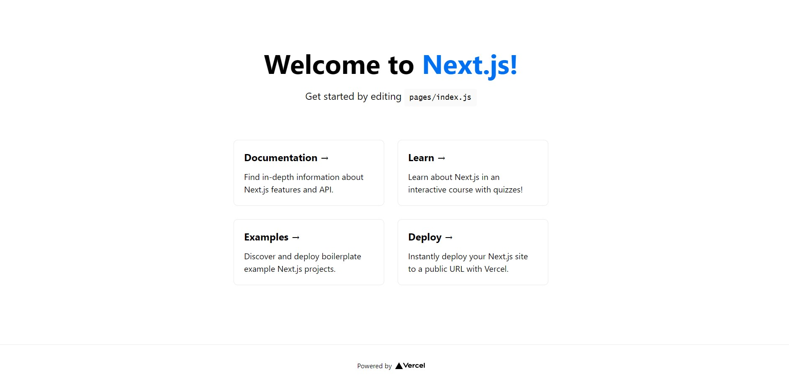
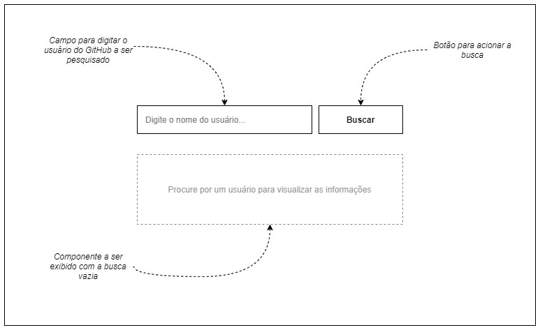
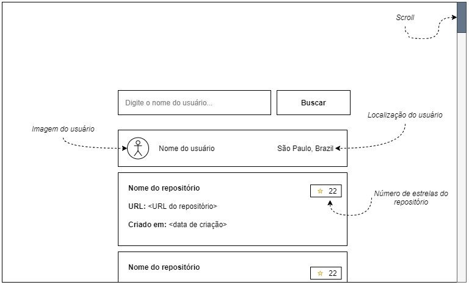

# Onboarding - Front

## Introdução

Antes de iniciar sua jornada como desenvolvedor front-end no time de web da MedRoom, convidamos você a criar um pequeno projeto de exemplo, assim poderemos conhecer melhor suas habilidades técnicas e entender seu estilo de codificação!

## Iniciando

Vamos começar! Siga o passo a passo abaixo e, se tiver alguma dúvida, você poderá nos contatar pelo seguinte e-mail: victor.hugo@medroom.com.br

1. Clone este projeto em sua máquina com o comando: `git clone https://github.com/MedRoomGitHub/MedRoom.Web.FrontExam.git`

2. Entre na pasta do projeto recém clonado e execute os seguintes comandos para criar uma nova branch e instalar as dependências:

```powershell
# Se você não estiver com o yarn instalado, instale-o com o comando a seguir
npm install -g yarn

# Substitua <meu-nome> pelo seu primeiro nome
git checkout -b "<meu-nome>-front-end"
yarn install
```

3. Abra o diretório do projeto em seu Visual Studio Code

4. No terminal do Visual Studio Code, execute o comando: `yarn dev`

5. O projeto estará disponível na URL: [http://localhost:3000](http://localhost:3000)

6. Se você ver a seguinte página inicial ao acessar o link, parabéns! Você completou os passos iniciais! Agora vamos seguir para a explicação do projeto.



## Projeto

Agora mãos à obra! O seu objetivo vai ser criar uma simples aplicação que leia os dados de um usuário do GitHub. O esqueleto do projeto já está montado utilizando o framework [Next.JS](https://nextjs.org/learn/foundations/about-nextjs).

Veja as funcionalidades esperadas e os mocks a seguir:

> **Funcionalidades**:
> 
> 1. O usuário deverá ser capaz de procurar por um usuário no GitHub
> 2. Ao clicar no botão de Buscar, o sistema deverá realizar a busca na API do GitHub para trazer as informações do usuário e de seus repositórios
> 3. A busca também poderá ser ativada pela tecla "Enter" do teclado quando o foco estiver no campo de texto
> 4. A tela deverá ter scroll para mostrar todo o resultado da busca


- **Mock da página inicial:** esta é a primeira página a ser apresentada para o usuário. Ela é composta de um campo de busca (texto simples), um botão de buscar e um componente para indicar que não há dados a serem exibidos.



- **Mock de uma busca:** após realizar uma busca, a tela é atualizada com as informações do usuário e a lista de seus repositórios.

a. **Para o usuário**, deverão aparecer as informações: imagem (foto), nome e localização geográfica

b. **Para cada repositório**, deverão aparecer as informações: nome do repositório, número de estrelas, URL de acesso e data de criação (no formato dd/MM/yyyy)



- **Layout:** o layout da tela ficará por sua conta! Se você quiser, poderá utilizar qualquer biblioteca de estilização ao seu gosto, ou poderá também manter o estilo padrão do navegador. Você decide!

- **Bibliotecas:** você poderá adicionar e utilizar qualquer biblioteca para auxiliá-lo no desenvolvimento do projeto. O único requisito técnico é que deve ser utilizado o [Next.JS](https://nextjs.org/learn/foundations/about-nextjs) como framework.

- **Typescript:** se você se sentir confortável, poderá usar Typescript (as dependências já estão instaladas, basta criar arquivos com a extensão .ts/.tsx). Caso contrário, não tem problema em usar Javascript!

- Após finalizar o projeto, suba-o no GitHub com os comandos a seguir e nos avise via e-mail (victor.hugo@medroom.com.br)!

```powershell
git add .
git commit -m "Projeto inicial de front-end"
git push --set-upstream origin <meu-nome>-front-end
```

## API

Para desenvolver o projeto, você poderá utilizar a própria [API do GitHub](https://docs.github.com/en/rest/guides/getting-started-with-the-rest-api).

Você irá precisar especificamente dos seguintes endpoints:

a. **https://api.github.com/users/<nome do usuário>** *(retorna as informações do usuário)*

b. **https://api.github.com/users/<nome do usuário>/repos** *(retorna a lista de repositórios do usuário)*

**OBS:** as chamadas acima são públicas e não necessitam de autorização mas, se você enfrentar problemas de limitação de chamadas, você poderá se autenticar na API utilizando um token de autorização juntamente ao Octokit: https://docs.github.com/en/rest/quickstart?tool=javascript

